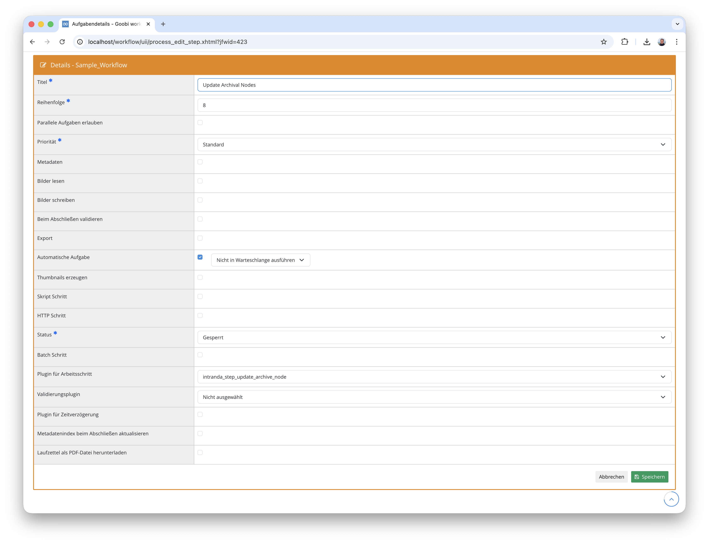

## Einführung
Die vorliegende Dokumentation beschreibt die Installation, Konfiguration und den Einsatz des Plugins für die automatische Erstellung von Archivknoten und die Aufspaltung von Vorgängen. Das Plugin erstellt innerhalb einer EAD-Tektonik einen neuen Archivknoten unterhalb eines konfigurierten Elternknotens, überträgt Metadaten aus dem aktuellen Vorgang in den neuen Knoten und erzeugt daraus einen neuen Goobi-Vorgang. Konfigurierte Metadaten und Ordner werden dabei aus dem ursprünglichen Vorgang entfernt bzw. in den neuen Vorgang verschoben.


## Installation
Zur Nutzung des Plugins muss es an folgenden Ort kopiert werden:

```bash
/opt/digiverso/goobi/plugins/step/plugin-step-nodecreation-and-split-base.jar
```

Die Konfiguration des Plugins wird unter folgendem Pfad erwartet:

```bash
/opt/digiverso/goobi/config/plugin_intranda_step_nodecreation_and_split.xml
```

Darüber hinaus wird die Konfiguration des Plugins `intranda_step_update_archive_node` benötigt, da das Plugin dessen Konfiguration für die Anbindung an das Archivmanagement nutzt:

```bash
/opt/digiverso/goobi/config/plugin_intranda_step_update_archive_node.xml
```

Dieses Plugin setzt außerdem voraus, dass die folgenden Plugins installiert sind:

- `plugin-administration-archive-management`
- `plugin-step-update-archive-node`


## Überblick und Funktionsweise
Nachdem das Plugin installiert und konfiguriert wurde, kann es in einem Workflowschritt als automatische Aufgabe eingebunden werden. Hierbei sollte darauf geachtet werden, dass der Schritt als `Automatische Aufgabe` markiert ist.



Das Plugin führt bei der Ausführung folgende Schritte durch:

- Der aktuelle Vorgang wird geöffnet und seine Metadaten gelesen.
- Es wird geprüft, ob die konfigurierten Metadaten und Ordner noch im Vorgang vorhanden sind. Falls nicht, wird angenommen, dass der Vorgang bereits aufgespalten wurde, und das Plugin beendet sich erfolgreich ohne weitere Aktion.
- Die Archivkonfiguration wird geladen und ein Elternknoten in der EAD-Tektonik anhand der Konfiguration gesucht.
- Unterhalb des Elternknotens wird ein neuer Archivknoten erstellt und mit den Metadaten des aktuellen Vorgangs befüllt.
- Auf Basis einer konfigurierten Produktionsvorlage wird ein neuer Goobi-Vorgang erzeugt. Der Vorgangstitel wird dabei automatisch anhand der Archivkonfiguration generiert.
- Die konfigurierten Metadaten (einschließlich Personen, Körperschaften und Metadatengruppen) werden aus dem Quellvorgang entfernt.
- Die konfigurierten Ordner werden vom Quellvorgang in den neuen Vorgang verschoben.
- Automatische Aufgaben im neuen Vorgang werden gestartet.


## Konfiguration

### Konfiguration des Plugins
Die Konfiguration des Plugins erfolgt in der Datei `plugin_intranda_step_nodecreation_and_split.xml` wie hier aufgezeigt:

{{CONFIG_CONTENT}}

{{CONFIG_DESCRIPTION_PROJECT_STEP}}

Parameter               | Erläuterung
------------------------|------------------------------------
`processTemplate`       | Name der Produktionsvorlage, die als Grundlage für den neu zu erstellenden Vorgang dient.
`metadata`              | Name eines Metadatums, das nach der Aufspaltung aus dem Quellvorgang entfernt werden soll. Dieses Element kann mehrfach angegeben werden, um mehrere Metadaten zu entfernen. Es werden dabei reguläre Metadaten, Personen und Körperschaften gleichen Namens berücksichtigt.
`group`                 | Name einer Metadatengruppe, die nach der Aufspaltung aus dem Quellvorgang entfernt werden soll. Dieses Element kann ebenfalls mehrfach angegeben werden.
`folder`                | Name eines Ordners, der vom Quellvorgang in den neuen Vorgang verschoben werden soll. Der Name muss einem Standardordner (z.B. `master`, `media`) entsprechen oder in der `goobi_config.properties` definiert sein. Dieses Element kann mehrfach angegeben werden.


### Konfiguration der Archivanbindung
Das Plugin nutzt intern die Konfiguration des Plugins `intranda_step_update_archive_node`. Diese Konfiguration wird aus der Datei `plugin_intranda_step_update_archive_node.xml` gelesen und definiert die Anbindung an die EAD-Tektonik. Relevante Parameter sind:

Parameter                  | Erläuterung
---------------------------|------------------------------------
`identifierMetadataField`  | Name des Metadatums im Goobi-Vorgang, das die Knoten-ID enthält.
`identifierNodeField`      | Name des Feldes im Archivknoten, das als Identifikator dient.
`nodeTypeBranch`           | Knotentyp für Verzweigungsknoten (z.B. `folder`). Standardwert: `folder`.
`nodeTypeLeaf`             | Knotentyp für Blattknoten (z.B. `file`). Standardwert: `file`.
`archive`                  | Name des Archivs, in dem der Knoten erstellt werden soll.
`parentNodeId`             | ID des Elternknotens, unter dem der neue Knoten angelegt wird. Kann mit dem Attribut `doctype` pro Dokumenttyp separat konfiguriert werden.
`defaultParentNodeId`      | Standard-Elternknoten-ID, falls für den aktuellen Dokumenttyp kein spezifischer Elternknoten konfiguriert ist.

Eine beispielhafte Konfiguration sieht wie folgt aus:

```xml
<config_plugin>
    <config>
        <project>*</project>
        <step>*</step>

        <identifierMetadataField>NodeId</identifierMetadataField>
        <identifierNodeField>reference code</identifierNodeField>
        <nodeTypeBranch>folder</nodeTypeBranch>
        <nodeTypeLeaf>file</nodeTypeLeaf>
        <archive>archiveName</archive>

        <parentNodeId doctype="Monograph">parent_id_123</parentNodeId>
        <defaultParentNodeId>default_parent_id</defaultParentNodeId>
    </config>
</config_plugin>
```


## Arbeitsweise im Detail
Bei der Ausführung durchläuft das Plugin die folgenden Phasen:

### 1. Prüfung auf bereits erfolgte Aufspaltung
Zunächst wird geprüft, ob die konfigurierten Metadaten oder Ordner noch im Quellvorgang vorhanden sind. Ist dies nicht der Fall, wird davon ausgegangen, dass die Aufspaltung bereits in einem früheren Durchlauf stattgefunden hat. Das Plugin beendet sich dann ohne Fehler.

### 2. Erstellung des Archivknotens
Ein neuer Archivknoten wird als Kindknoten des konfigurierten Elternknotens erstellt. Die Metadaten des aktuellen Vorgangs werden anhand des konfigurierten Metadaten-Mappings der Archivverwaltung in den neuen Knoten übertragen.

### 3. Erstellung des neuen Vorgangs
Auf Grundlage der konfigurierten Produktionsvorlage wird ein neuer Goobi-Vorgang erstellt. Der Vorgangstitel wird automatisch mittels des `ProcessTitleGenerator` auf Basis der in der Archivkonfiguration definierten Titelkomponenten generiert. Falls der generierte Titel bereits existiert, wird automatisch ein alternativer eindeutiger Titel verwendet.

### 4. Bereinigung des Quellvorgangs
Alle per `<metadata>` und `<group>` konfigurierten Metadaten, Personen, Körperschaften und Metadatengruppen werden aus der logischen Dokumentstruktur des Quellvorgangs entfernt.

### 5. Verschiebung von Ordnern
Die per `<folder>` konfigurierten Ordner werden vom Quellvorgang in den neuen Vorgang verschoben. Falls ein konfigurierter Ordner im Quellvorgang nicht existiert, wird er übersprungen.

### 6. Start automatischer Aufgaben
Nach Abschluss aller Schritte werden im neuen Vorgang alle offenen automatischen Aufgaben gestartet, damit der Workflow des neuen Vorgangs automatisch fortgesetzt wird.
