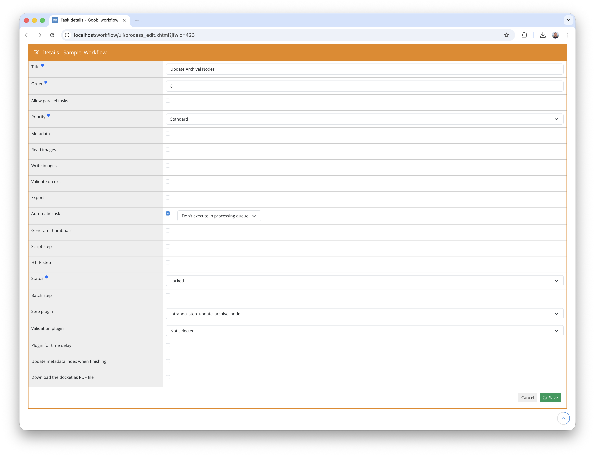

## Introduction
This documentation describes the installation, configuration and use of the plugin for automatic archive node creation and process splitting. The plugin creates a new archive node within an EAD hierarchy below a configured parent node, transfers metadata from the current process into the new node and creates a new Goobi process from it. Configured metadata and folders are removed from or moved out of the original process into the new process.


## Installation
To use the plugin, it must be copied to the following location:

```bash
/opt/digiverso/goobi/plugins/step/plugin-step-nodecreation-and-split-base.jar
```

The plugin configuration is expected at the following path:

```bash
/opt/digiverso/goobi/config/plugin_intranda_step_nodecreation_and_split.xml
```

Additionally, the configuration of the plugin `intranda_step_update_archive_node` is required, as this plugin uses its configuration for connecting to the archive management:

```bash
/opt/digiverso/goobi/config/plugin_intranda_step_update_archive_node.xml
```

This plugin also requires the following plugins to be installed:

- `plugin-administration-archive-management`
- `plugin-step-update-archive-node`


## Overview and functionality
Once the plugin has been installed and configured, it can be integrated into a workflow step as an automatic task. The step should be marked as `Automatic task`.



When executed, the plugin performs the following steps:

- The current process is opened and its metadata is read.
- It checks whether the configured metadata and folders still exist in the process. If not, it is assumed that the process has already been split, and the plugin finishes successfully without further action.
- The archive configuration is loaded and a parent node is located within the EAD hierarchy based on the configuration.
- A new archive node is created below the parent node and populated with metadata from the current process.
- A new Goobi process is created based on a configured process template. The process title is automatically generated based on the archive configuration.
- The configured metadata (including persons, corporates and metadata groups) are removed from the source process.
- The configured folders are moved from the source process to the new process.
- Automatic tasks in the new process are started.


## Configuration

### Plugin configuration
The plugin is configured in the file `plugin_intranda_step_nodecreation_and_split.xml` as shown here:

{{CONFIG_CONTENT}}

{{CONFIG_DESCRIPTION_PROJECT_STEP}}

Parameter               | Explanation
------------------------|------------------------------------
`processTemplate`       | Name of the process template to be used as the basis for the newly created process.
`metadata`              | Name of a metadata field to be removed from the source process after splitting. This element can be specified multiple times to remove multiple metadata fields. Regular metadata, persons and corporates with the same name are all considered.
`group`                 | Name of a metadata group to be removed from the source process after splitting. This element can also be specified multiple times.
`folder`                | Name of a folder to be moved from the source process to the new process. The name must correspond to a standard folder (e.g. `master`, `media`) or be defined in `goobi_config.properties`. This element can be specified multiple times.


### Archive connection configuration
The plugin internally uses the configuration of the plugin `intranda_step_update_archive_node`. This configuration is read from the file `plugin_intranda_step_update_archive_node.xml` and defines the connection to the EAD hierarchy. Relevant parameters are:

Parameter                  | Explanation
---------------------------|------------------------------------
`identifierMetadataField`  | Name of the metadata field in the Goobi process that contains the node ID.
`identifierNodeField`      | Name of the field in the archive node that serves as identifier.
`nodeTypeBranch`           | Node type for branch nodes (e.g. `folder`). Default: `folder`.
`nodeTypeLeaf`             | Node type for leaf nodes (e.g. `file`). Default: `file`.
`archive`                  | Name of the archive in which the node should be created.
`parentNodeId`             | ID of the parent node under which the new node will be created. Can be configured per document type using the `doctype` attribute.
`defaultParentNodeId`      | Default parent node ID, used when no specific parent node is configured for the current document type.

An example configuration looks as follows:

```xml
<config_plugin>
    <config>
        <project>*</project>
        <step>*</step>

        <identifierMetadataField>NodeId</identifierMetadataField>
        <identifierNodeField>reference code</identifierNodeField>
        <nodeTypeBranch>folder</nodeTypeBranch>
        <nodeTypeLeaf>file</nodeTypeLeaf>
        <archive>archiveName</archive>

        <parentNodeId doctype="Monograph">parent_id_123</parentNodeId>
        <defaultParentNodeId>default_parent_id</defaultParentNodeId>
    </config>
</config_plugin>
```


## Detailed operation
During execution, the plugin goes through the following phases:

### 1. Check for previous splitting
First, it is checked whether the configured metadata or folders are still present in the source process. If this is not the case, it is assumed that the splitting has already taken place in an earlier run. The plugin then finishes without an error.

### 2. Archive node creation
A new archive node is created as a child of the configured parent node. The metadata of the current process is transferred into the new node based on the metadata mapping configured in the archive management.

### 3. New process creation
A new Goobi process is created based on the configured process template. The process title is automatically generated using the `ProcessTitleGenerator` based on the title components defined in the archive configuration. If the generated title already exists, an alternative unique title is automatically used.

### 4. Source process cleanup
All metadata, persons, corporates and metadata groups configured via `<metadata>` and `<group>` are removed from the logical document structure of the source process.

### 5. Folder transfer
The folders configured via `<folder>` are moved from the source process to the new process. If a configured folder does not exist in the source process, it is skipped.

### 6. Starting automatic tasks
After all steps are completed, all open automatic tasks in the new process are started so that the workflow of the new process continues automatically.
